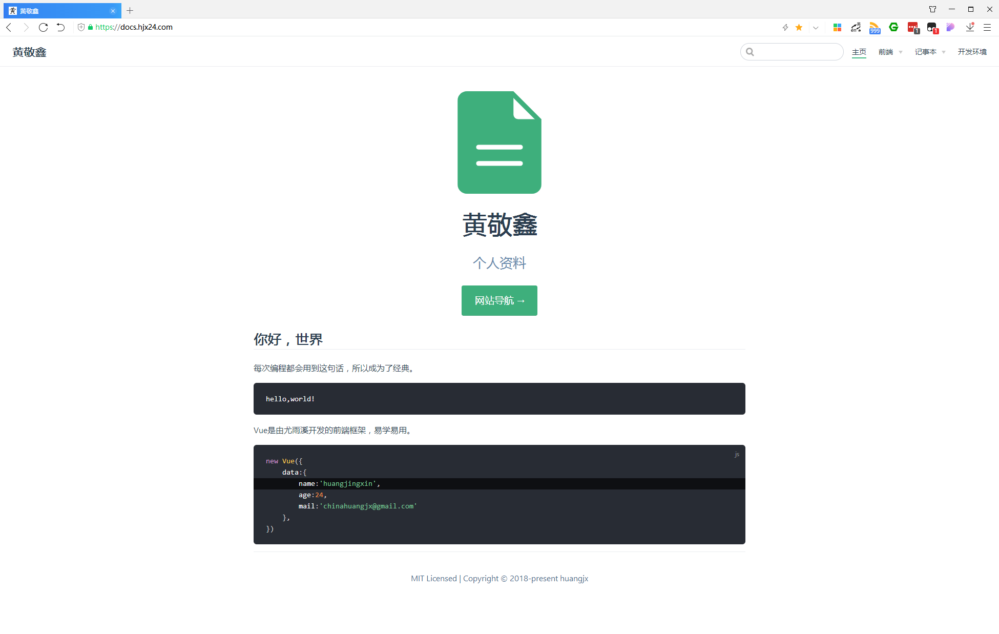

# 网站导航

> 码东西的时候容易忘词，所以有了这样一个网站。- 这个网站能够帮助我快速查找。

## 前端

基础扎实，才能所向披靡、无所畏惧。

- JavaScript
- CSS
- HTML
- Note

## 记事本

整理东西是我的一大爱好，我希望经过我手的东西都能够井井有条。

- windows
- Linux
- Server
- Software
- Note

## 开发环境

前端工程化，能随时部署开发环境非常重要。

## 结束语

人的一生要走多少路，才是归宿。既决定要活得潇洒，就要无所顾忌，该吃就吃，该睡就睡，做事不抱怨。将事情变简单，将生活变有趣。

时刻提醒自己➩『喜欢，就继续下去！』