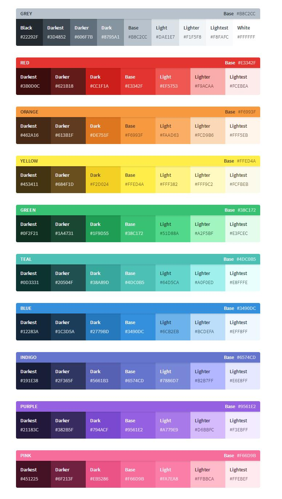

# tailwind

一个实用工具集 CSS 框架，用于快速构建定制化用户界面。

```bash
# yarn 安装 tailwindcss
yarn add tailwindcss --dev

# 配置文件
.\node_modules\.bin\tailwind init tailwind.js

# 加入 .postcssrc.js 
const tailwindcss = require('./tailwind');
'tailwindcss': tailwindcss,

# 加入 main.js
import 'tailwindcss/dist/tailwind.min.css'
```

## [颜色](https://www.tailwindcss.cn/docs/colors/)

常用颜色的查询及使用



## 字体

| 样式     | 名称           | 写法           |
| -------- | -------------- | -------------- |
| 大小     | font-size      | text-lg        |
| 粗细     | font-weight    | font-bold      |
| 左右间距 | letter-spacing | tracking-wide  |
| 上下间距 | line-height    | leading-normal |

## 列表

| 样式     | Class      | Properties                    |
| -------- | ---------- | ----------------------------- |
| 去掉样式 | list-reset | list-style: none; padding: 0; |