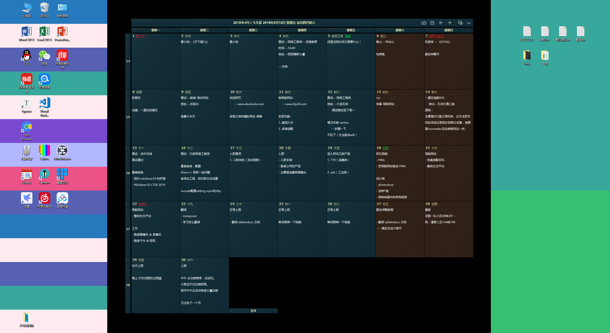

# canvas

> 使用 canvas 制作实用壁纸。

2019.5.9 阅读 [奔跑中的奶酪](https://www.runningcheese.com) 的一片文章 [向爱因斯坦学习桌面管理之道](https://www.runningcheese.com/desktop)。

突发奇想，决定给自己电脑桌面进行整理。

我不太喜欢桌面搞得花里胡哨的，也不想多出来一个桌面管理软件，而元素桌面过于单调，索性用 js 的 canvas 制作一张符合分辨率的图片，话不多说，开搞。

## 开始

虽说要简单实用，但是也要注意美观。在仔细尝试 n 多种方式后，探索求知的过程确实艰难。

下面介绍创作的过程，有趣而且绞尽脑汁。

### 1.0.0

此版本过于花俏，容易吸引注意力，便直接被废弃。

### 2.0.0

