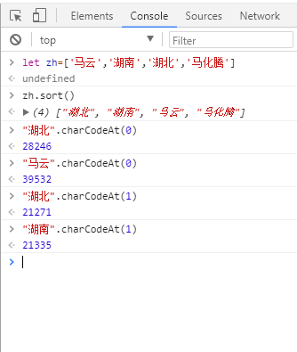

# sort排序

前端数据排序很常见到，有必要做一次总结。

## 数组排序

排序中最常用的就是数组排序，其中又分数字数组、字母数组和中文排序。

### 数字数组排序

由于 Js 数字不会自动按照大小排列，也就是:

```js
let num = [23,12,1,34,116,8,18,37,56,50,34];
num.sort()	//[1, 116, 12, 18, 23, 34, 37, 50, 56, 8]
```

很明显，出来的结果不是我们需要的。这时候就需要传一个函数进去：

```js
function compare(a,b){
	if(a>b) return 1;
	else if(a<b) return -1;
	else return 0;
})
num.sort(compare)	//[1, 8, 12, 18, 23, 34, 34, 37, 50, 56, 116]
```

### 字母数组排序

字母排序能正确显示，效果如下：

```js
let str = ['java','apple','alibaba','tencent','teacher','javascript'];
str.sort()	//["alibaba", "apple", "java", "javascript", "teacher", "tencent"]
```

### 中文数组排序

```js
let zh=['马云','湖南','湖北','马化腾']
zh.sort()	//["湖北", "湖南", "马云", "马化腾"]
```

中文默认是按照 `UTF-8` 编码进行排序的，可以用控制台把对应编码打印出来看一下：




中国人的习惯是用拼音来排序，windows 的文件系统就是按照拼音进行排序的。

::: tip 根据拼音排序

只需要把对应的中文放到表里面查一下，得到拼音，然后再根据拼音进行排序。

网上有很多这种表和 API，搜索一下即可得到。

:::

### 对象数组排序

```js
let arr = [
    {name:'zopp',age:3},
    {name:'gpp',age:18},
    {name:'yjj',age:8}
];
arr.sort((a,b)=>{	
	if(a.age>b.age) return 1;
	else if(a.age<b.age) return -1;
	else return 0;
})

//[
    {name:'zopp',age:3},
    {name:'yjj',age:8},
    {name:'gpp',age:18}
]
```

只要取出值来进行比较即可。

## 对象排序

实际情况中，遇到的数据通常不会像上面那么简单，大多数据都以对象为主。

### 对象的属性排序

首先声明，对象的 key 是有顺序的，它的顺序是赋值的时候给予的，所以只要重新给对象赋一次值，就可以改变它的顺序。操作如下：

```js
let person = {name: "huangjx", age: 23, school: 'szy', city: "shenzhen"};

let newkey = Object.keys(person).sort();
let newPerson = {};
newkey.forEach(x=>newPerson[x]=person[x])
console.log(newPerson)
//{age: 23, city: "shenzhen", name: "huangjx", school: "szy"}
```

### 对象的值排序

跟属性的排序差不多，只需要把对应数组取出来，排序，然后再赋值回去即可。不在累述。