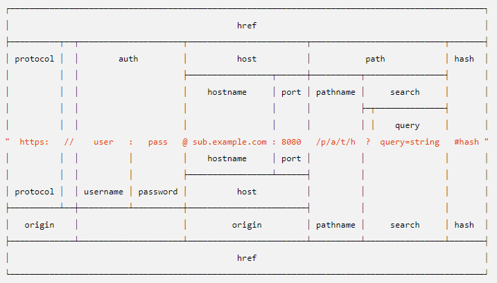

# 路径问题

> node 中的 path 和 url 模块。

## path

```js
# 绝对路径
path.resolve()

# 文件名
path.basename('path')

# 后缀名
path.extname('path')

# 路径解析（更多 API）
path.parse('path')
```

## url



```js
const url = require('url')
const myURL = new URL('https://www.hjx24.com/image/logo/80s.png?width=400');

# 获得相对路径
console.log(myURL.pathname)

# 获得协议名
console.log(myURL.protocol)

# 更多 api
console.log(myURL)
```

## 结合使用

要获得一个比较复杂网页中的有效部分，需两者结合使用。

```js
# 获得文件名
path.basename(myURL.pathname)

# 获得后缀名
path.extname(myURL.pathname)
```

