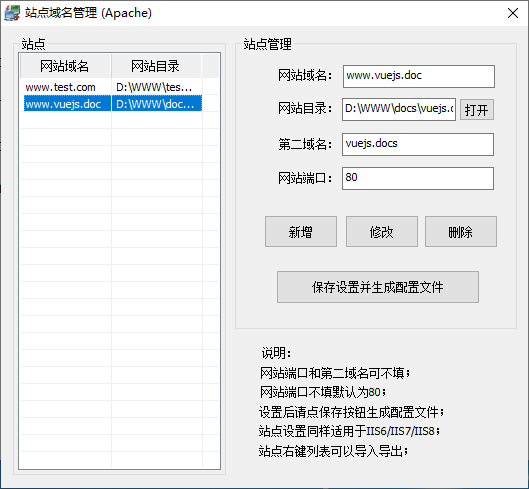
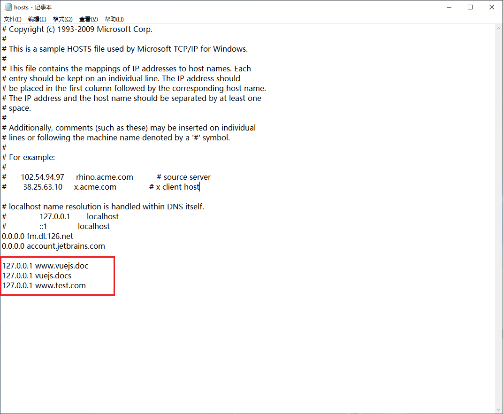
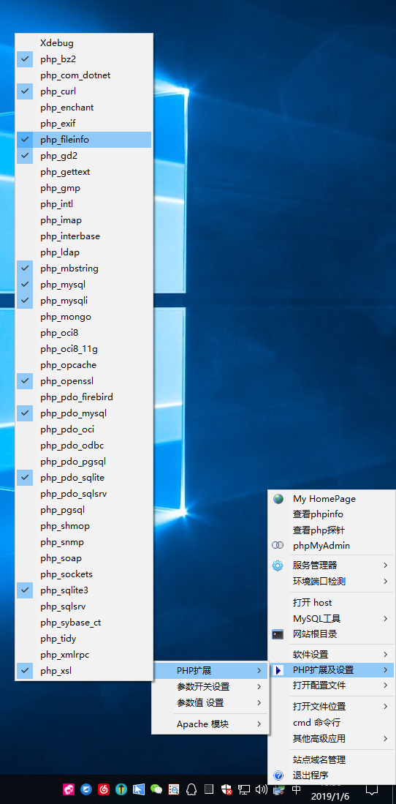

# phpStudy

前端设置 phpStudy 作为本地文档的静态服务器。

## 下载安装

地址：[php 中文网](http://phpstudy.php.cn/download.html)

## 配置

### 站点域名管理

随便填一个网址

比如：www.vuejs.doc

然后选择一个包含 index.html 的文件夹

新增→保存设置并生成配置文件

### Host

域名重定向

最后面添上：127.0.0.1 www.vuejs.doc

### 拓展设置

PHP拓展及设置→PHP拓展

勾选上 php_openssl、php_fileinfo

## 结束

至此，就可以成功访问 www.vuejs.doc 这个特殊后缀名的网址

## 参考链接

- https://baijunyao.com/article/114