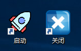
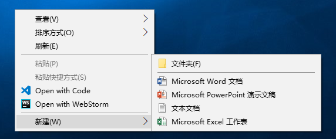

# windows

> 这里记录一些跟 windows 相关的东西

- [安装windows系统](./windows-install.md)

- [局域网多设备共享](./windows-share.md)

- [批处理常用命令](./batch-commend.md)

- [批处理高阶玩法](./batch-use.md)

  

  

  用上面两个能启动和关闭下面这一排。

- [强迫症之修改右键菜单](./windows-menu-change.md)

  

  我的右键菜单长这样，你的呢？