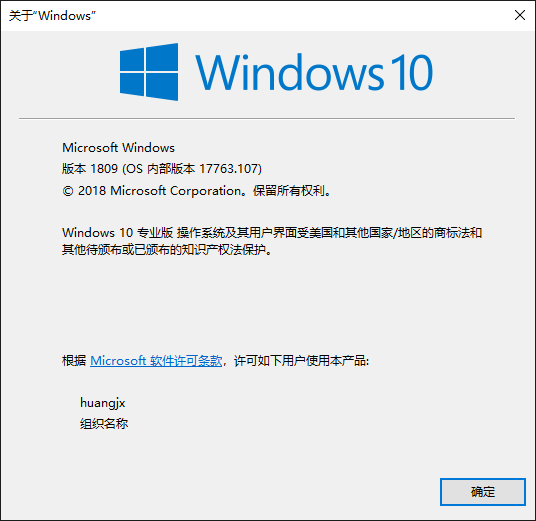

# 批处理常用命令

> 关键词：ipconfig、msconfig、cls、ren

## 实用命令

首先介绍一些实用的命令，你可以直接在 CMD 中输入，然后查看运行结果。

```bash
# 查看 IP 地址
ipconfig

# 查看系统版本
winver

# 查看电脑详细信息 有 系统名称、版本、类型等
msinfo32.exe

# CMD 清屏
cls

# 系统配置
msconfig
```

## 常用命令

例举一些常用命令，复杂的操作不推荐使用批处理。

```bash
# 列表
ls

# 显示路径
pwd

# 文件操作
ren、cp、mv、del

# 保存
>
# 举例：文件名保存到 1.xls，可用于重命名
ls -name >1.xls
```

## 终端区别

PowerShell 和 CMD 的区别：

- CMD 是 PowerShell 的子集
- 部分 CMD 命令不能在 PowerShell 中运行
- PowerShell 支持更多命令

## 结束语

**新的东西出现，就要大胆尝试，拒绝接受也许就是退步**。PowerShell 也许更好用，只是很多人不接受而已，包括我。当初说 Windows 7 更好用的我，现在 Windows 10 也很香。

