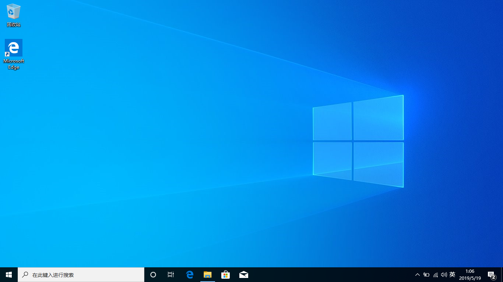
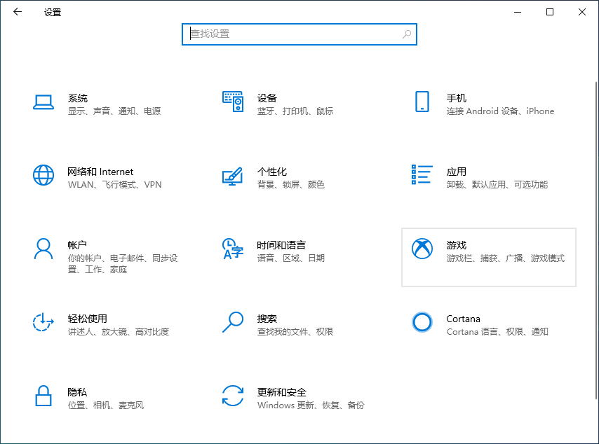
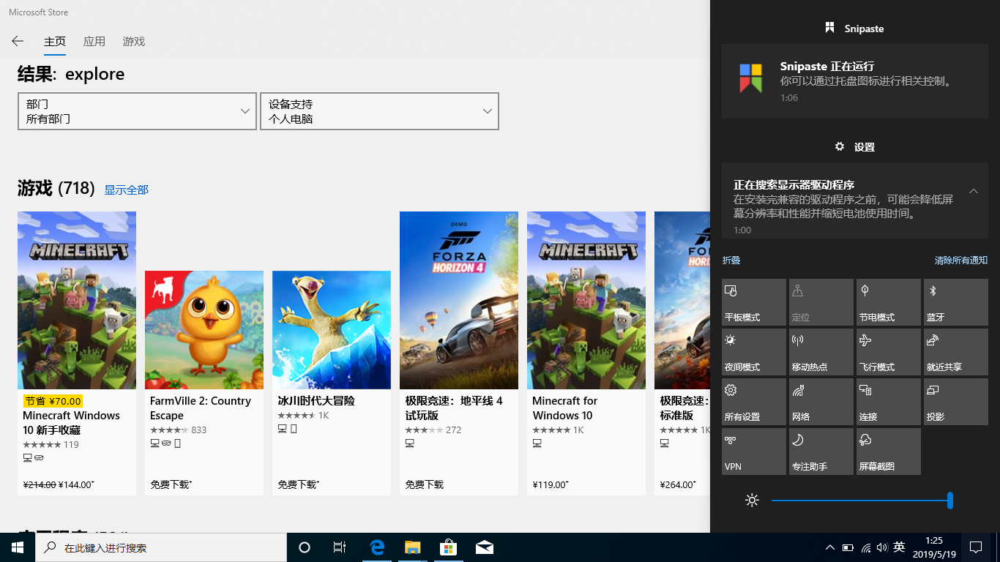
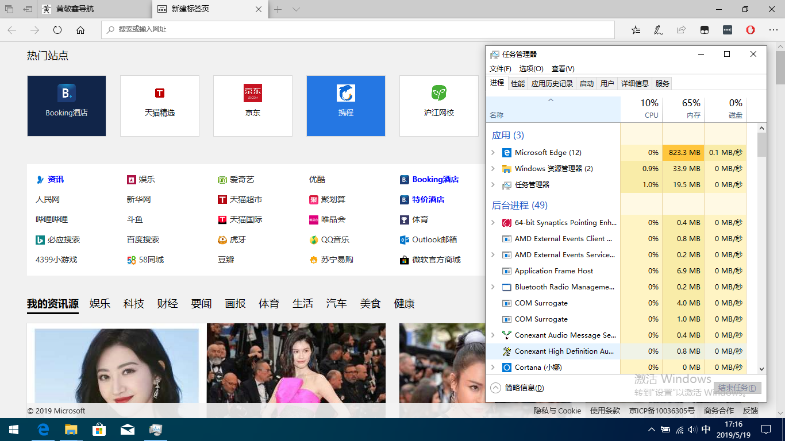
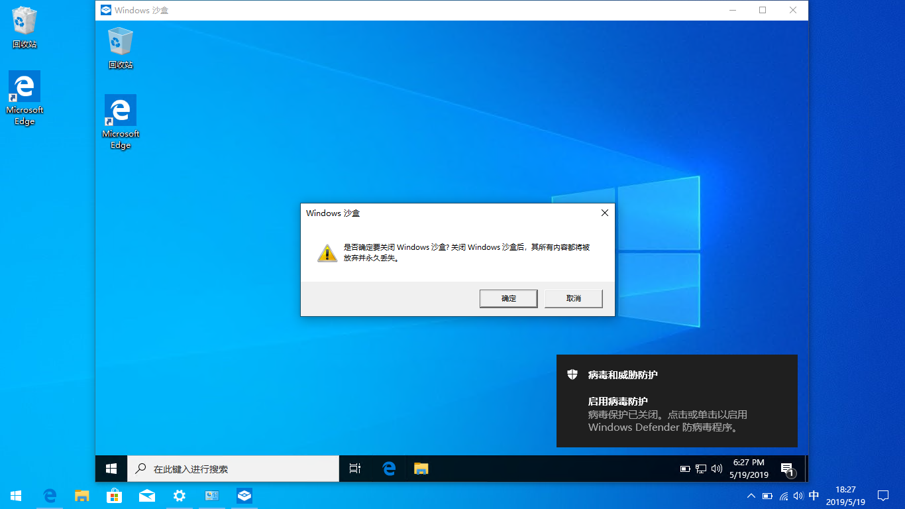
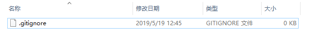

# win10 1903 使用体验

今天（2019-5-18）给笔记本装上了 win10 1903 ，尝鲜体验一波。

## 安装

从 msdn 下载的镜像，安装过程没什么变化，就是多问了几个无关紧要的问题。

## 使用

亲身感受到，不一样的几点

- 桌面壁纸（**Metro** 风格）

  

- 设置（更清晰的分类）

  

- 通知菜单（亮度可控调节，屏幕截图按钮）

  

- 蓝屏一次

  时间 2019-5-19 13：44 出现蓝屏，重启恢复

- Microsoft Edge（就是微软一直推，却一直不火的浏览器，下面可以看出来原因）

  这内存占用之多，跟 webstorm 不相上下，简直可怕。

## 新功能

官方说的新功能，有必要体验一下。 

- 沙盒

  Windows Sandbox 是一次性的，关闭即清除。它模拟的系统跟你当前的系统一模一样。

  

- 投屏

  只支持特定的手机，我的 iphone 不能用。

- wsl（访问 Linux 子系统文件）

  讲真的，我只用 CentOs 系统，但是上面没有，就没有玩。

- 空名文件

  也就是说，不需要编辑器的情况下，你可以直接创建 .gitignore 文件

  

- 相对时间

  刚刚、几分钟前，几小时前 等相对时间