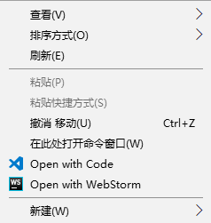
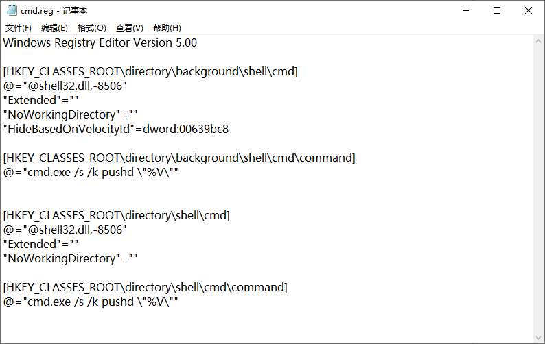
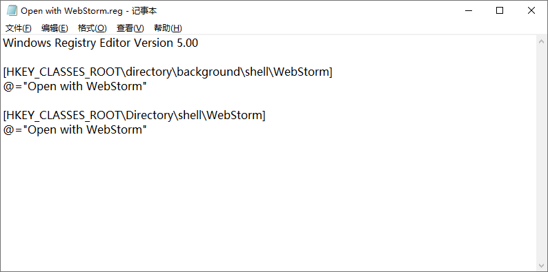

# windows右键菜单

如果只是单纯的删除部分右键菜单选项，推荐使用软件**右键管家**。

## 重新调出『shift+右键』的 CMD

powershell 没有 cmd 好用，重新调出『在此处打开命令窗口』，效果如下：



注册表文件



附上代码

```
Windows Registry Editor Version 5.00

[HKEY_CLASSES_ROOT\directory\background\shell\cmd]
@="@shell32.dll,-8506"
"Extended"=""
"NoWorkingDirectory"=""
"HideBasedOnVelocityId"=dword:00639bc8

[HKEY_CLASSES_ROOT\directory\background\shell\cmd\command]
@="cmd.exe /s /k pushd \"%V\""


[HKEY_CLASSES_ROOT\directory\shell\cmd]
@="@shell32.dll,-8506"
"Extended"=""
"NoWorkingDirectory"=""

[HKEY_CLASSES_ROOT\directory\shell\cmd\command]
@="cmd.exe /s /k pushd \"%V\""
```

## 修改右键 WebStorm

默认的 webstorm 选项很长，把它变成 Open with WebStorm 。效果如下：


导入的注册表文件



附上代码：

```
Windows Registry Editor Version 5.00

[HKEY_CLASSES_ROOT\directory\background\shell\WebStorm]
@="Open with WebStorm"

[HKEY_CLASSES_ROOT\Directory\shell\WebStorm]
@="Open with WebStorm"
```


