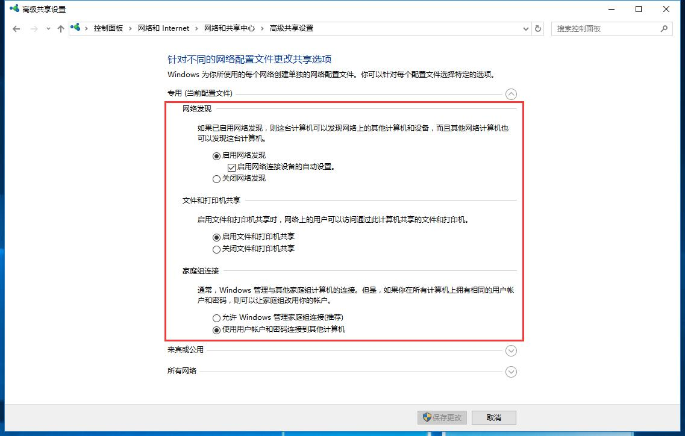

# 局域网内多设备之间的共享

## 电脑与电脑的共享

很多人家里都会有两台电脑，笔记本和台式，回到家的时候台式电脑用的多，笔记本一般在上班时候用。周末你用家里的台式机下载了一部好看的电影，你想等到上班的时候用笔记本看，怎么操作呢？用U盘吗？ 活在是21世纪的今天，你该学会用共享操作了，ftp直接访问，省时不费事（减少了U盘的插拔，省去了繁琐的操作）。

### 共享设置

1）打开共享设置

系统属性➩远程➩允许

2）防火墙关闭

专用、公用都关闭

3）开启远程服务

运行 services.msc ➩开启 Remote Desktop services

4）关闭密码保护

网络和共享中心➩高级共享设置➩启用网络发现&关闭密码保护共享

5）磁盘共享

打开文件管理器➩右键➩属性➩共享➩高级共享➩共享此文件夹

### 共享文件

​        ////192.168.2.102/D$

### 远程桌面

​	运行 mstsc ➩输入对方电脑 IP

## 电脑与手机、平板的共享

你是否有这样的烦恼，在电脑上下载一本电子书或者一部电影，你想放到手机或者平板上，然后躺在床上看。小说倒是可以用QQ发送，但是电影的话就会很麻烦，下面就教你一些奇淫技巧，接好了🤔

### iphone 和 ipad 使用 **nplayer** 

  
  

这个软件非常强大，就像是电脑上的potplayer一样。如果你的电脑共享了磁盘，你可以轻松通过扫描网络，直接播放电脑上的电影，此过程并不需要下载。

你可以在 [appstore](https://itunes.apple.com/cn/app/id1116905928?mt=8) 花30块大洋下载，没有条件的可以移步 [pp助手](https://www.25pp.com/ios/detail_959431/) 。

### 安卓可以使用 MXplayer 和 ES文件浏览器  

- **MXplayer**       	可以播放远程视频
- **ES文件浏览器 **        可以获取远程文件

## FAQ

如果以上设置还不能使你正常远程，可以尝试再设置下面几个：

1. 本地安全策略➩本地策略➩安全选项➩网络访问：本地账户的共享和安全模型

   将  ”仅来宾“ 设置  “经典”

2. 计算机管理➩用户➩隶属于

   添加 administrator

3. connection reset by peer（[@百度贴吧](https://tieba.baidu.com/p/5788013442)）

   nplayer出现这个错误时，一般是电脑没有开启共享

   

